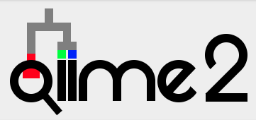

# qiime-tools

Scripts and ideas round the **[Qiime2](https://qiime2.org/)** platform

* [create_QIIME2_SILVA_artifacts](create_QIIME2_SILVA_artifacts.md)

* [create_QIIME2_rrnDB_artifacts](create_QIIME2_rrnDB_artifacts.md)

* [Simplify labels in Qiime plots](simplify_qiime-plots.md)

*Disclaimer: This is not an official QIIME2 site but only personal code and results to use with QIIME2*

**Please let me know if you find typos or inconsistencies and of course suggest additional tracks using the Issue tracker above**

*&copy;Stephane Plaisance, VIB-Nucleomics Core*

------------

This work is licensed under a [Creative Commons Attribution-ShareAlike 3.0 Unported License](http://creativecommons.org/licenses/by-sa/3.0/).
